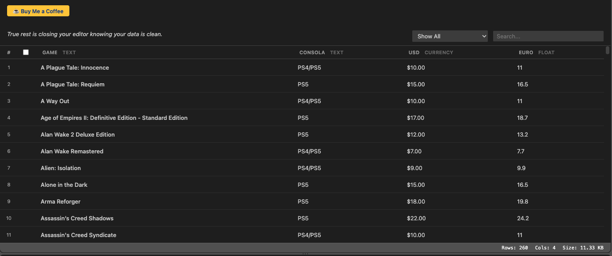

# CSV Studios

The most beautiful way to view and edit CSV files in VS Code.

## 🎬 Demo

https://github.com/user-attachments/assets/cc11c37b-91a0-4d0c-b305-6519b4b96e54

> **Note:** If the video doesn't play above, you can [download it here](images/preview.mp4).

## 🌟 Features

- **Interactive Table View**: View CSV and TSV files in a clean, spreadsheet-like table.
- **Direct Cell Editing**: Edit cells directly in the table view.
- **Header Management**: Update and edit column headers directly from the interface.
- **Row Operations**: Insert new rows above or below existing ones, or delete them via a context menu.
- **Column Operations**: Add new columns, insert them before or after existing ones, or safely delete them using the column context menu.
- **Bulk Actions**: Select multiple rows at once and delete them simultaneously using the action bar.
- **Real-time Sync**: The table view automatically updates if the underlying text document is modified externally.
- **State Retention**: The extension retains your context and view state even when the editor tab is hidden.
- **Performance**: Fast rendering, even for large files.

## 🚀 Usage

- Open any `.csv` or `.tsv` file and it will automatically open in the CSV Studios table view.
- Use the **+ New row** and **+ New column** toolbar buttons to quickly expand your dataset.
- Right-click on rows or columns to access advanced insertion and deletion commands.

## ⚙️ Requirements

No additional requirements.

## 🐛 Known Issues

None reported yet. If you find a bug, please [open an issue](https://github.com/yohervz/csv-studios/issues).

## 📦 Release Notes

### 0.1.7
- Added preview image and demo video to the README.

### 0.1.6
- Duplicate Data Filter, Status Bar, Motivational Phrases, and Buy Coffee button.

### 0.1.5
Initial release of CSV Studios.